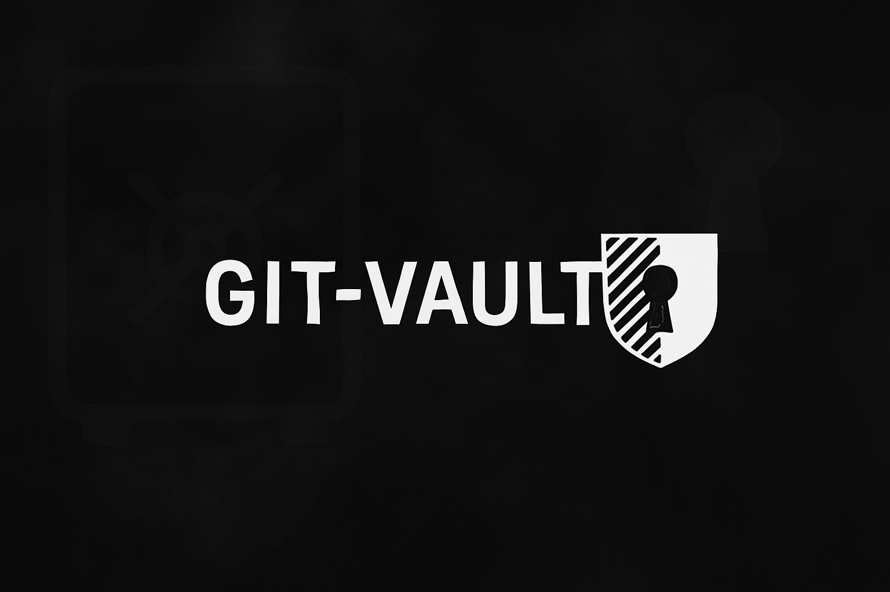

<div align="center">
  
  <div align="center">
    <b>Store sensitive files and folders in git</b>
  </div>
  <p>
    <a href="https://github.com/zackiles/git-vault/actions/workflows/release.yml">
      
    </a>
    <a href="https://chocolatey.org/packages/git-vault">
      
    </a>
    <a href="https://github.com/zackiles/homebrew-git-vault">
      
    </a>
  </p>
</div>

## Why

`gv /path/to/thing`... and everything is handled for you seamlessly. Files/folders/blobs, big and small. Seals and unseals itself. Doesn't get easier than that.

## How

Git hooks and GPG transparently encrypt and decrypt resources within your repository into `.vault`, sealing them remotely and unsealing locally. Works on all **platforms**, **dummy-proof**, and **secure**! Optionally supports and configures Git LFS, 1Password, and more automatically.

- **Encryption (`pre-commit`):** Seals items to `.vault/storage/`
- **Decryption (`post-checkout`, `post-merge`):** Unseals items back to their original locations
- **Passwords:** Read from `.vault/*.pw` files or fetched from 1Password (`op` CLI), per `.vault/config.json`

> [!TIP]
> Checkout some examples of [When To Use It](#when-to-use-it).

## Installation

Install git-vault with a single command or via package managers.

### Manual Installation

```bash
curl -fsSL https://raw.githubusercontent.com/zackiles/git-vault/main/install.sh | bash
```

### Package Managers

**Homebrew (macOS/Linux):**

```bash
brew tap zackiles/homebrew-git-vault
brew install gv
```

**Chocolatey (Windows):**

```powershell
choco install gv
```

The installer downloads the correct binary, checks dependencies (git, gpg), sets up your repository, and can optionally install `gv` globally.

The process creates `.vault/` for configuration/storage, an empty `.vault/config.json`, installs Git hooks, updates `.gitignore`, and can configure Git LFS or 1Password.

> [!NOTE]
> GPG must be installed; this is verified during initialization.

## Uninstallation

Assuming you no longer have repositories that gv manages secrets for and you'd like to remove it globally from your system can do so by running:

```bash
gv uninstall
```

This will determine how it was installed and use the appropriate uninstaller if you used a package manager like Brew or Chocolatey (or it falls back to manually removing itself).

> [!NOTE]
> To remove git-vault from a specific project without uninstalling the CLI:
>
> - Run `gv remove-all`
> - Remove gv-related entries from `.gitignore`

## Usage

**Add a file or folder to the vault:**

```bash
gv <path/to/your/secret>
```

The command encrypts and stores your file in `.vault/storage/`, updates `.gitignore`, and manages the password (local file or 1Password). Easy peasy!

**Remove from vault:**

```bash
gv remove <path/to/your/secret>
```

Verifies password, removes archive/manifest entry, cleans up password.

**List vaulted items:**

```bash
gv list
```

Displays managed files/directories, status, and archive sizes.

> [!IMPORTANT]
> Your .gitignore will be automatically updated to ignore the password files and you're safe to commit everything else including `.vault/storage/` and `.vault/config.json`)

## Git LFS Integration

Manages large encrypted archives efficiently with Git LFS. Files over a threshold (default 5MB) are tracked via LFS if available. Make sure you have Git LFS installed: [Install Git LFS](https://git-lfs.github.com/). You can change the default LFS threshold in `.vault/config.json`

## 1Password Integration

Uses 1Password CLI (`op`) for password management instead of local `.pw` files.

**Requirements:**

- [1Password CLI (`op`)](https://1password.com/downloads/command-line/) installed and configured.
- Signed into 1Password via CLI (`op signin`).

**Process:**

1. **Setup:** If `op` is detected at init, choose to use it. Select/specify a 1Password vault (default: "Git-Vault"). You can change it later if you want in `.vault/config.json`.
2. **Adding Files (`gv add`):** Creates a Secure Note in 1Password (title: `git-vault-<project>-<hash>`) with password, path, status.
3. **Removing Files:** It'll keep your 1Password password there but will mark the item status to "removed"

## When To Use It

- Share sensitive build artifacts with maintainers/CI/CD.
- Provide context to AI agents in AI-native codebases.
- Manage mixed data access in data/research-heavy repos.
- Secure files in inner-source projects with departmental firewalls.
- Encrypt large binaries (images, videos, datasets), especially with Git LFS.
- Need a simple, single-command solution for secure Git file storage.

## License

MIT License - see the [LICENSE](LICENSE) file for details.
